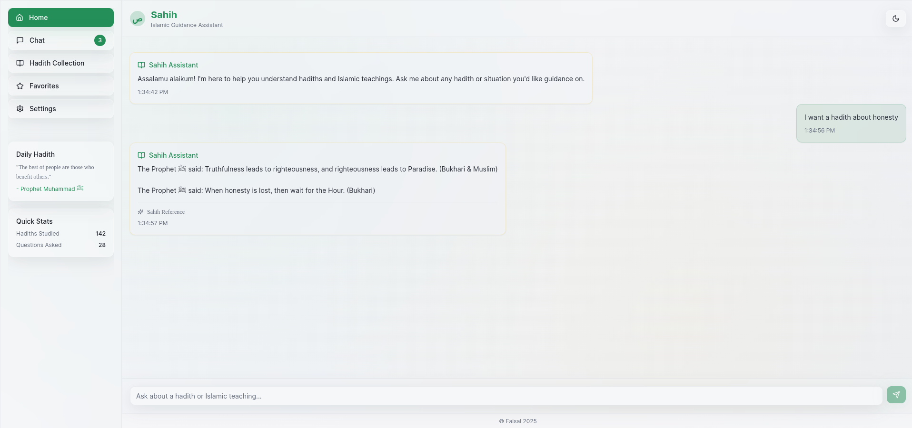

# AWS Serverless _Hadith_ Search APP

## Overview

This project provides a simple serverless API for retrieving Hadiths
based on user queries. The API is designed to simulate an AI-like
behavior where user queries such as "honesty" or "charity" return
related Hadiths.

The system is built using AWS serverless technologies, ensuring
scalability, reliability, and minimal operational overhead.

### Link to hosted app
https://d30t5tjr4vced5.cloudfront.net/

------------------------------------------------------------------------

## Architecture

The system uses the following components:

1. **AWS Lambda**: Hosts the serverless function that processes user queries and returns Hadith results.
2. **Amazon API Gateway**: Serves as the entry point for HTTP requests to the Lambda function.
3. **Amazon S3**: Stores static assets such as front-end files.
4. **AWS IAM**: Provides secure access control to the Lambda function and API Gateway resources.
5. **Amazon CloudWatch**: Used for logging, monitoring, and debugging the Lambda function.
6. **Amazon CloudFront**: Distributes static assets globally with low latency and provides a secure, scalable CDN for the hosted app.

------------------------------------------------------------------------

## AWS Services Used

### 1. AWS Lambda

-   Executes the serverless function in response to API requests.
-   Automatically scales based on demand.
-   Written in Node.js with modern JavaScript.

### 2. Amazon API Gateway

-   Provides a secure HTTP endpoint for users to send requests.
-   Integrates directly with Lambda.
-   Handles request validation, throttling, and CORS configuration.

### 3. AWS IAM (Identity and Access Management)

-   Manages roles and permissions for Lambda and API Gateway.
-   Ensures least-privilege access control.


### 5. Amazon S3

-   Can store front-end files or other assets that interact with the
    API.

------------------------------------------------------------------------

## Setup Instructions

### Prerequisites

-   AWS Account
-   AWS CLI installed and configured
-   Node.js installed

### Steps

1.  Clone this repository:

    ``` bash
    git clone https://github.com/Proc3ssa/sahih-hadith.git
    cd sahih-hadith
    ```

2.  Install dependencies:

    ``` bash
    npm install
    ```

3.  Deploy Lambda function:

    -  

        ``` javascript
            inside lanbda funtion.mjs
        
        ```

    -   Upload the ZIP file in AWS Lambda console or use AWS CLI.

4.  Create API Gateway:

    -   Set up a new REST API or HTTP API.
    -   Connect it to your Lambda function.

5.  Assign IAM Role:

    -   Attach a role to the Lambda function with permissions for
        CloudWatch logging.

6.  Test the API:

    -   Lambda request url:

        ``` bash
        curl "https://jf2gf47ttf.execute-api.us-east-1.amazonaws.com/hadith?q=honesty"
        ```

------------------------------------------------------------------------

## Example Queries

-   `/api?q=honesty` → Returns Hadiths about honesty.
-   `/api?q=charity` → Returns Hadiths about charity.
-   `/api?q=patience` → Returns "No hadith found for this query."

------------------------------------------------------------------------

## Screenshots



------------------------------------------------------------------------

## Author

**Name:** Faisal\
**Role:** Developer\
**Email:** <pros3sa@gmail.com>

------------------------------------------------------------------------

## License

This project is open-source. You are free to use and modify it as
needed.
